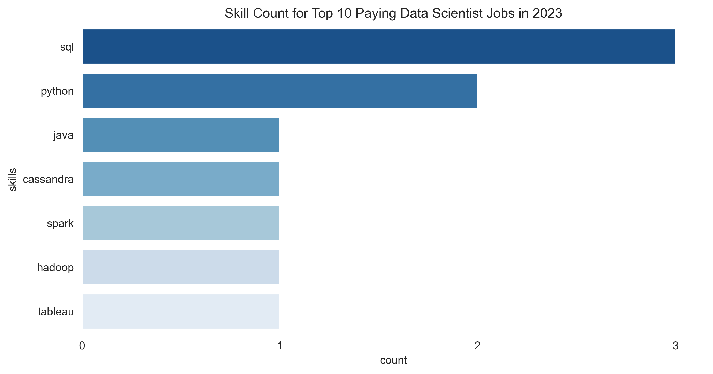
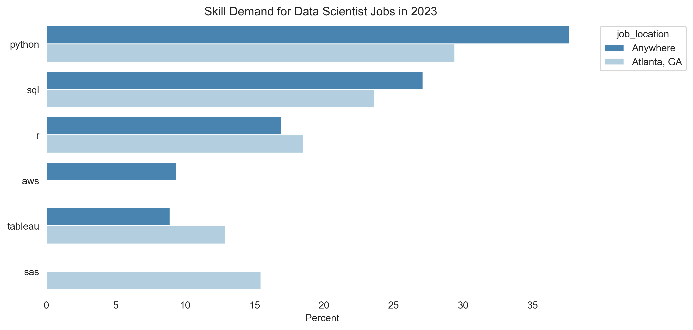
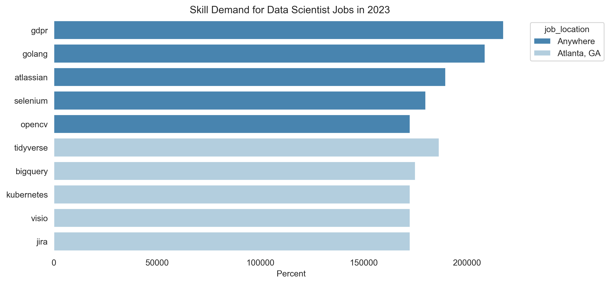
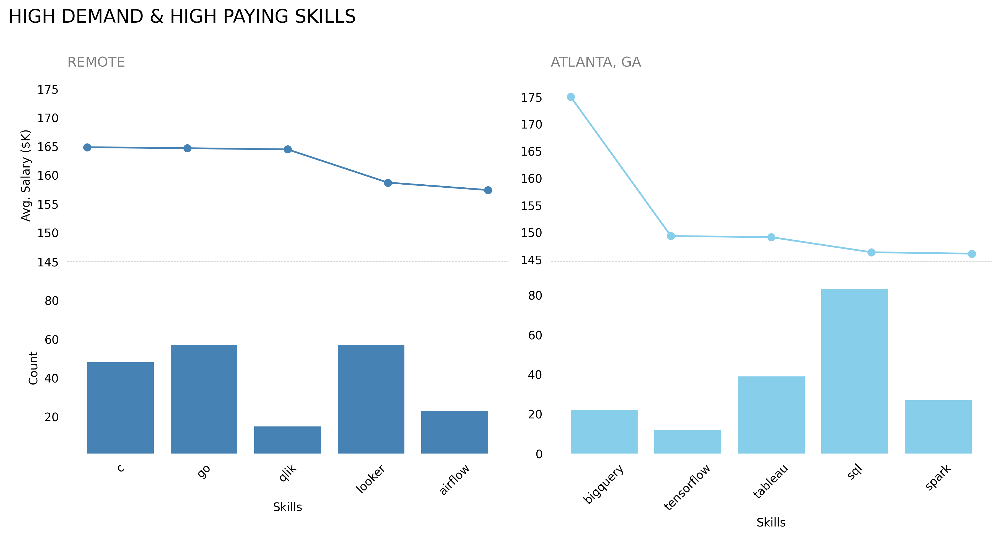

# Introduction
To gain a comprehensive understanding of the data science landscape, particularly regarding salary expectations and required skillsets, a thorough analysis of current job postings is a advantageous!

Check out the [SQL Queries](/project/)

# Background

This project is derived from Luke Barousse's [SQL for Data Analytics Course](https://www.youtube.com/watch?v=7mz73uXD9DA) and has been modified to my preference for **Data Scientist** roles in **Atlanta, GA or remote**. 

To delve into the exciting world of data science, I'll be leveraging the power of SQL to unlock valuable insights from job postings specifically,

- Analyzing **salary trends in 2023** to comprehend the typical compensation range for Data Scientists.
- Examining job descriptions to identify the **most sought-after skills** for success in this field.


### Tools Used
- SQL
- PostgresSQL
- Visio Studio Code
- Python
- Git & Github

# The Analysis

The analysis is structured to answer the following questions
1. What are the top-paying jobs for Data Scientist role in Atlanta, GA or remote?
2. What skills are required for these top paying roles?
3. What are the most in-demand skills for my role?
4. What are top skills based on the salary for my role?
5. What are the most optimal skills to learn
    - Optimal = High Demand and High Paying

### 1. Top Paying Data Scientist Jobs

The initial analysis commenced by filtering Data Scientist positions based on average annual salary. The focus was on positions located in Atlanta, GA, as well as those offering remote work flexibility. This filtering aimed to identify high-compensation opportunities within the Data Science field.

```sql
SELECT
    job_id,
    job_title,
    job_location,
    job_schedule_type,
    salary_year_avg,
    job_posted_date,
    company_dim.name
FROM 
    job_postings_fact
LEFT JOIN company_dim
    ON job_postings_fact.company_id = company_dim.company_id
WHERE
    job_title_short = 'Data Scientist'
    AND salary_year_avg IS NOT NULL
    AND job_location IN ('Atlanta, GA','Anywhere')
ORDER BY 
    salary_year_avg DESC
LIMIT 10;
```
<br>

**Results**

According to the initial query results below, the most lucrative data scientist position offered an average yearly salary of $550,000 for remote work and $375,000 in Atlanta, GA. Moreover, 70% of the highest-paying positions in the top 10 are Director or Head of Data Science roles.

| job_title | job_location | salary_year_avg |
| --- | --- | --- |
|Staff Data Scientist/Quant Researcher|Anywhere|550000|
|Staff Data Scientist - Business Analytics|Anywhere|525000|
|Data Scientist|Anywhere|375000|
|Data Science Director|Atlanta, GA|375000|
|Head of Data Science|Anywhere|351500|
|Head of Data Science|Anywhere|324000|
|Director Level - Product Management - Data Science|Anywhere|320000|
|Director of Data Science & Analytics|Anywhere|313000|
|Distinguished Data Scientist|Anywhere|300000|
|Head of Battery Data Science|Anywhere|300000|


### 2. Top Paying Data Scientist Skills 

Begin by joining the skills and job post tables to retrieve the skill requirements for the top 10 highest-paying data scientist positions. Subsequently, export the results to a CSV file and import them into a Jupyter Notebook to generate a count plot using Python.


```sql
WITH top_paying_jobs AS 
(
    SELECT
        job_id,
        job_title,
        salary_year_avg,
        company_dim.name
    FROM 
        job_postings_fact
    LEFT JOIN company_dim
        ON job_postings_fact.company_id = company_dim.company_id
    WHERE
        job_title_short = 'Data Scientist'
        AND salary_year_avg IS NOT NULL
        AND job_location IN ('Atlanta, GA','Anywhere')
    ORDER BY 
        salary_year_avg DESC
)
SELECT 
    top_paying_jobs.*,
    skills
FROM
    top_paying_jobs
INNER JOIN skills_job_dim
    ON top_paying_jobs.job_id = skills_job_dim.job_id
INNER JOIN skills_dim
    ON skills_job_dim.skill_id = skills_dim.skill_id
ORDER BY 
    salary_year_avg DESC
LIMIT 10;
```

**Results**

Based on the chart below, SQL emerges as the most essential skill, followed closely by Python and Java. This highlights the significance of programming language proficiency as a primary requirement for the most lucrative data scientist positions. Furthermore, well-compensated data scientist roles necessitate expertise and proficiency in databases like Cassandra, familiarity with data processing systems including Spark and Hadoop, as well as competence in data visualization tools like Tableau.




### 3. Top Demanded Skills for Data Scientist

We understand the skills needed for the highest-paid data scientist positions, but what about the demand for these skills? To achieve this, write a [SQL query](project\3_top_demanded_skills.sql) to consolidate the total count of the top 5 skills for each location then use python to normalized the demand count by location plot the results.

```python
# Calculate total demand_count for each job_location
no3['total_demand'] = no3.groupby('job_location')['demand_count'].transform('sum')

# Normalize demand_count based on total_demand
no3['normalized_demand'] = (no3['demand_count'] / no3['total_demand']) *100

# Set plot size
fig, ax = plt.subplots(figsize=(10,5),dpi=300)

# Create barplot
sns.barplot(data=no3, x='normalized_demand', y="skills",palette='Blues_r', hue='job_location')

# Remove ticks
ax.tick_params(left=False, bottom=False) 

# Remove borders borders
sns.despine(left=True, bottom=True)                        

# Set legend location
sns.move_legend(ax, "upper left", bbox_to_anchor=(1, 1))   

# Turn of x/y labels
plt.xlabel(' Percent')
plt.ylabel(None)

# Assign Plot Title
plt.title("Skill Demand for Data Scientist Jobs in 2023", fontsize=12)

# Plot
plt.show()
```
<br>



**Results**

Python emerged as the most popular skill demanded for both remote and Atlanta based data scientist jobs, followed by SQL, R. After taking into account the demand, the main difference from the previous finding is java has been replaced by R. This remphasize previously mentioned importance placed on programming language skills. 

### 4. Top Payings Skills for Data Scientist based on salary

Given our understanding of the most sought-after skills for this position, let's delve deeper and identify the key skills that correlate with higher salaries in specific locations.


**Results**

Interestingly, the top 5 skills commanding the highest salaries vary between remote positions and those based in Atlanta, GA. 

**In remote** roles, the most lucrative skills include GDPR, followed by Golang and Atlassian, emphasizing their relevance in software development, compliance, and automation. These skills underscore a strategic and developmental focus within data scientist roles.

Conversely, **in Atlanta**, the top-paying skills such as Tidyverse, BigQuery, and Kubernetes indicate the roles prioritize expertise in handling data, utilizing cloud-based data solutions, and managing scalable application deployments.

When comparing the highest-paying skills, salaries in both locations range from $150K to $212K. However, on average, remote positions command higher salaries per skill compared to roles based in Atlanta. Remote job skills can surpass $200K, whereas salaries for skills in Atlanta typically stay below $200K.

<br>




### 5. Top in-demand skills with high average salaries for Data Scientist 

Previously, we identified the top data scientist skills based on salary. However, does the skill with the highest salary correspond to high demand? To gain a comprehensive perspective, let's rank skills based on both demand and average salaries.


**Results**

When comparing the most sought-after skills with the highest salaries, the findings diverge from previous expectations. For example, in remote job settings, skills like C (earning $165K), Go ($164.7K), and Qlik ($164K) command significant salaries despite varying demand levels of 48, 57, and 15 respectively.

Conversely, in Atlanta, GA, data scientist positions highlight different top-paying skills such as BigQuery ($175K), TensorFlow ($149K), and Tableau ($149K). Notably, SQL ranks fourth in terms of salary ($146K) despite being the most demanded skill.




# What I Learned
This project provided me with the opportunity to leverage SQL skills for conducting thorough exploratory data analysis (EDA) focused on job market trends within the data scientist domain. By applying SQL, I was able to extract, transform, and analyze large datasets effectively, gaining insights into various aspects of the job market such as demand trends, salary ranges, geographical preferences, and required skill sets.

# Conclusion
Top-paying data scientist roles average $550,000 annually for remote positions and $375,000 in Atlanta, GA, with 7 out of 10 of these roles being Director or Head of Data Science positions.

Proficiency in SQL, Python, and Java is essential for high-paying data scientist positions, complemented by expertise in databases like Cassandra, data processing systems such as Spark and Hadoop, and data visualization tools like Tableau.

Python is the most in-demand skill for both remote and Atlanta-based data scientist roles, followed by SQL and R, with R replacing Java compared to previous findings, highlighting the continued emphasis on programming language proficiency.

Remote data scientist roles emphasize skills related to GDPR, Golang, and Atlassian for software development, compliance, and automation, commanding higher average salaries per skill compared to Atlanta-based positions, which prioritize Tidyverse, BigQuery, and Kubernetes for data management and cloud solutions.

The comparison between sought-after skills and highest salaries shows significant divergences, with remote roles valuing C, Go, and Qlik despite varying demand, while in Atlanta, GA, data scientist positions prioritize BigQuery, TensorFlow, and Tableau over SQL despite its high demand.

# Insights
For data scientist job seekers, the following insights and recommendations can be derived from the information provided:

**Skill Prioritization:** Focus on developing strong skills in Python, SQL, and R, as these are consistently in high demand across both remote and Atlanta-based positions. Stay updated with emerging technologies like Cassandra, Spark, Hadoop, and Tableau, which are crucial for data processing and visualization.

**Salary Considerations:** Understand the salary differentials between remote and Atlanta-based roles. Remote positions tend to offer higher average salaries, possibly due to a broader geographic scope and specialized skill requirements. Evaluate how your skill set aligns with the compensation trends in these locations.

**Continuous Learning:** Given the dynamic nature of the field, prioritize continuous learning and staying updated with new technologies and methodologies. This adaptability not only enhances your skill set but also makes you more competitive in the job market.